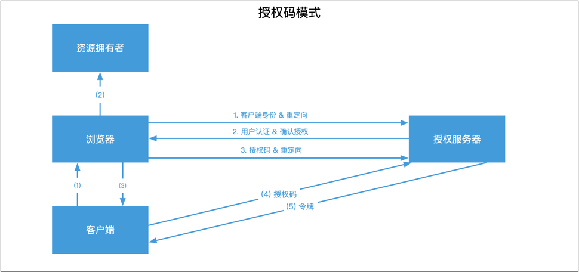
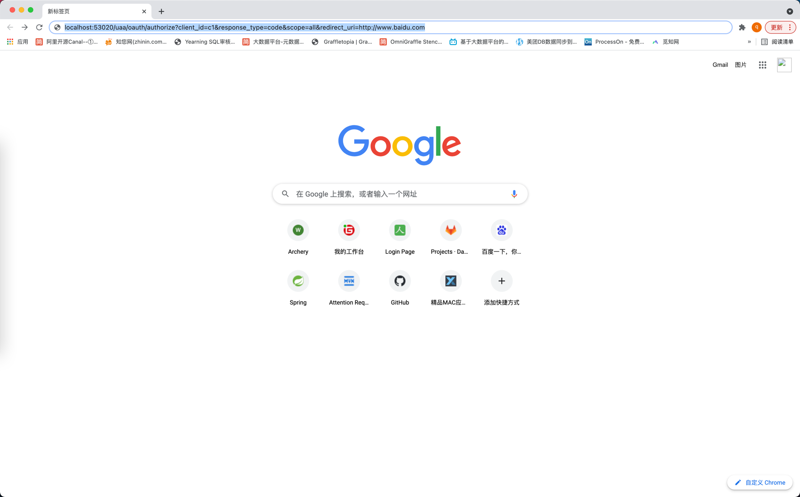
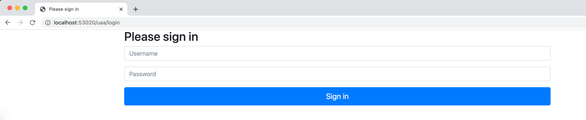
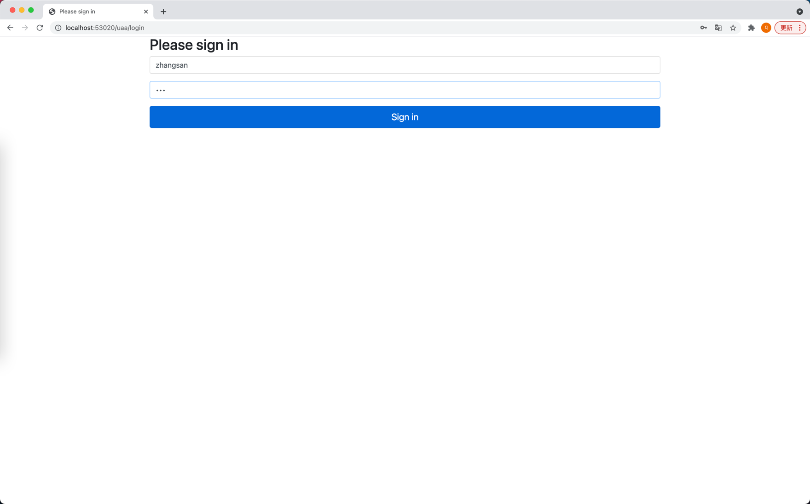
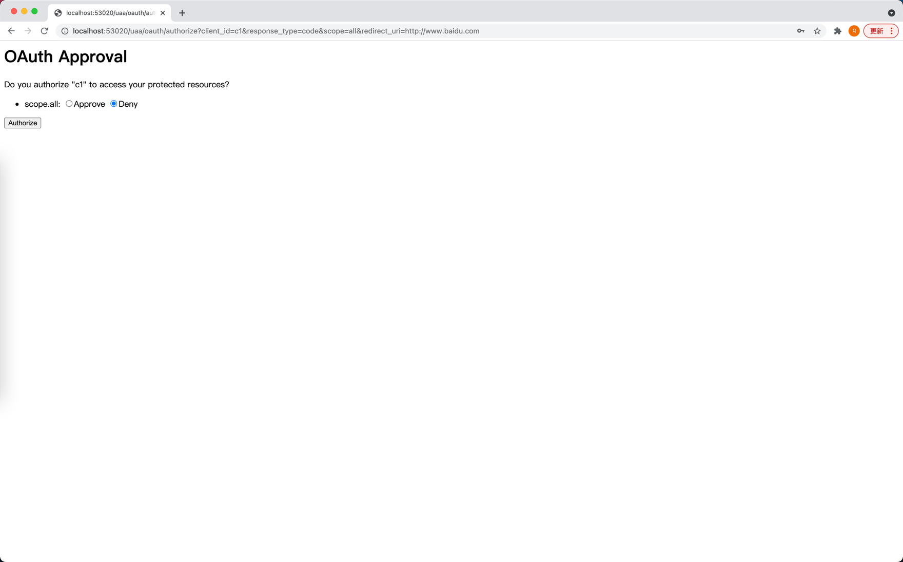
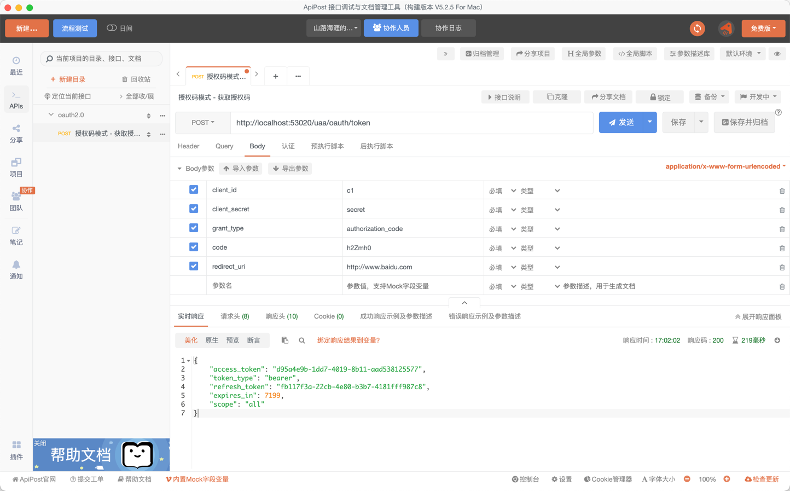
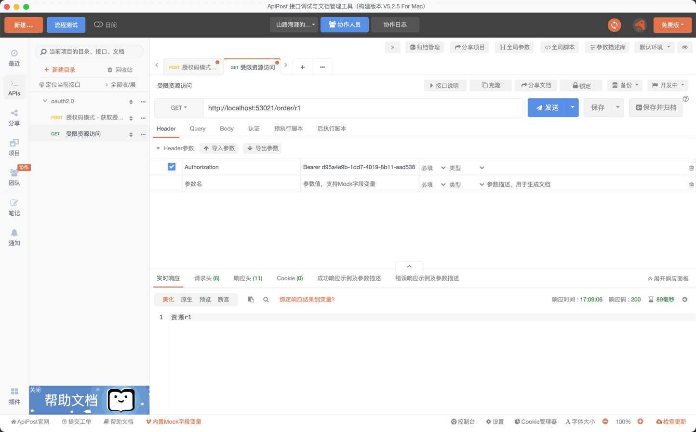

SpringCloud OAuth2.0基础配置版
------
## 授权模式


### 1. 授权码模式
1) 用户访问客户端

资源拥有者(用户)打开客户端，客户端要求资源拥有者给予授权，它将浏览器被重定向到授权服务器，重定向时会附加客户端的身份信息。如:

```
/uaa/oauth/authorize?client_id=c1&response_type=code&scope=all&redirect_uri=http://www.baidu.com
```

参数列表如下:

- client_id: 客户端准入标识。
- response_type: 授权码模式固定为code。
- scope: 客户端权限。
- redirect_uri: 跳转uri，当授权码申请成功后会跳转到此地址，并在后边带上code参数(授权码)。





2) 用户授权

浏览器出现向授权服务器授权页面，用户同意授权。


3) 授权码转发给客户端

授权服务器将授权码(AuthorizationCode)转经浏览器发送给client(通过redirect_uri)。

我们得到如下的授权码，附加在redirect_url后面:
```
https://www.baidu.com/?code=V9TXXS
```

4) 客户端拿授权码索要access_token

客户端拿着授权码向授权服务器索要访问access_token，请求如下:

```
/uaa/oauth/token?client_id=c1&client_secret=secret&grant_type=authorization_code&code=OJllzd&redirect_uri=http://www.baidu.com
```

参数列表如下

- client_id:客户端准入标识。
- client_secret:客户端秘钥。
- grant_type:授权类型，填写authorization_code，表示授权码模式 code:授权码，就是刚刚获取的授权码，注意:授权码只使用一次就无效了，需要重新申请。
- redirect_uri:申请授权码时的跳转url，一定和申请授权码时用的redirect_uri一致。

5) 授权服务器返回令牌(access_token)



这种模式是四种模式中最安全的一种模式。一般用于client是Web服务器端应用或第三方的原生App调用资源服务的时候。因为在这种模式中access_token不会经过浏览器或移动端的App，而是直接从服务端去交换，这样就最大限度的减小了令牌泄漏的风险。

### 2. 简化模式

### 3. 密码模式

### 4. 客户端模式


## 资源服务


添加Authorization请求头:

```
Bearer d95a4e9b-1dd7-4019-8b11-aad538125577
```

